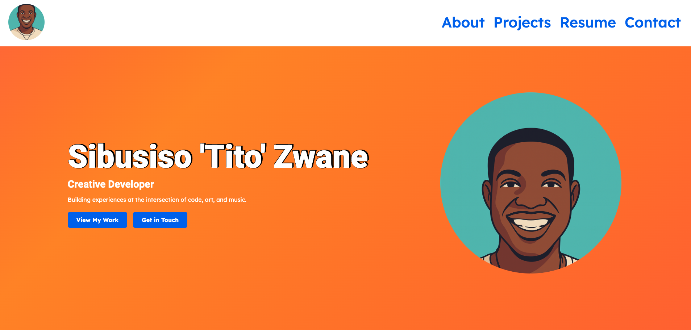
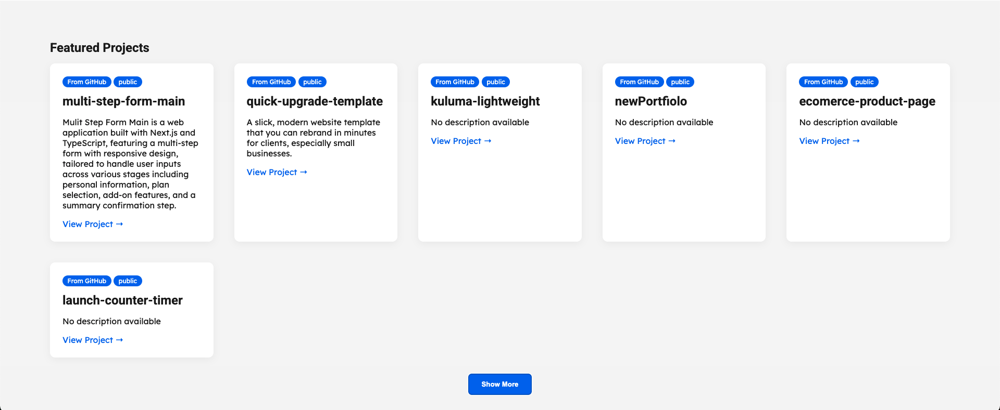

````markdown
# Sibusiso Zwane | Creative Developer

> **Building experiences at the intersection of code, art, and music.**


## 🌟 Overview

This is my personal portfolio site, built to showcase my work, skills, and creative projects.
It’s designed with **modern, minimal, and bold aesthetics** to leave a strong first impression for recruiters and potential clients.

**Live Site:** [View Portfolio](https://www.titozwane.com/)

---

## 🖥 Tech Stack

- **React + Vite** – Fast and lightweight SPA setup
- **Styled Components** – Component-scoped styling with theme support
- **GitHub API Integration** – Fetches latest public & private repositories (via token)
- **Formspree** – Contact form with validation + toast notifications
- **Responsive & Mobile-Friendly** – Optimized across devices

---

## 📂 Features

- **Hero Section** – Bold animated background + tagline
- **About Section** – Personal story & unique value proposition
- **Projects Highlight** – Live data from GitHub + JSON for non-repo projects, “Show More” lazy load
- **Resume Page** – Animated vertical timeline of experience
- **Contact Page** – Formspree-powered form with feedback messages
- **Smooth Navigation** – Mobile dropdown with animation, scroll to sections

---

## 📸 Screenshots

### Hero


### Projects


---

## 🚀 Getting Started

**Clone & Install**
```bash
git clone https://github.com/PullingStrings/portfolio.git
cd portfolio
npm install   # or yarn install
````

**Run Development Server**

```bash
npm run dev   # or yarn dev
```

**Build for Production**

```bash
npm run build
```

---

## 📬 Contact Me

📧 Email: [titozwane28@gmail.com](mailto:titozwane28@gmail.com)
🔗 LinkedIn: [linkedin.com/in/titozwane](https://linkedin.com/in/titozwane)
💻 GitHub: [github.com/PullingStrings](https://github.com/PullingStrings)

---

**© 2025 Sibusiso Zwane**
Designed & developed with ❤️

